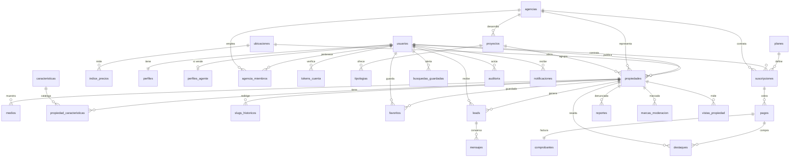

# Wasipe — Esquema de base de datos

DDL ejecutable: [`src/db/migraciones/001_inicial.sql`](src/db/migraciones/001_inicial.sql) · 30 tablas · PostgreSQL 15+

---

## 1. Decisiones que atraviesan todo el esquema

| Decisión | Qué elegí | Por qué |
|---|---|---|
| Claves primarias | `UUID DEFAULT gen_random_uuid()` | El código actual ya genera UUIDs con `randomUUID()` pero los guarda como `TEXT` (37 bytes vs 16). **La base está vacía hoy: este es el único momento en que corregirlo sale gratis.** `gen_random_uuid()` es nativo desde PG13, no necesita pgcrypto |
| Dinero | `NUMERIC(14,2)` | El esquema actual usa `DOUBLE PRECISION` para `precio`. Es un error: los flotantes acumulan error de redondeo y en cobros no cuadran. **Corregir antes de facturar** |
| Estados | `TEXT` + `CHECK` | No `ENUM` nativo: agregar un valor a un ENUM es `ALTER TYPE` y **quitarlo es prácticamente imposible**. Con CHECK se cambia con un DROP/ADD CONSTRAINT. Además los resultados se leen en claro |
| Fechas | `TIMESTAMPTZ` siempre | Lima es UTC-5 sin horario de verano, pero `TIMESTAMP` sin zona rompe apenas aparece un servidor en otra región |
| Borrado | `eliminado_en` (baja lógica) en `usuarios` y `propiedades` | Ley 29733 de datos personales exige poder dar de baja; el borrado físico se lleva leads y pagos por delante |
| Multi-moneda | `precio_ref_usd` mantenida por trigger | Ver §6 — es el problema más serio del modelo actual |

---

## 2. Relaciones



### Las cuatro relaciones que hay que entender bien

**1. Quién publica: usuario obligatorio, agencia opcional.**
`propiedades.usuario_id NOT NULL` + `propiedades.agencia_id NULL`. Todo aviso tiene una persona responsable. Si además pertenece a una agencia, el equipo entero puede editarlo. Así un agente que se va de la inmobiliaria no se lleva la cartera.

**2. Suscripción: de un usuario *o* de una agencia, nunca de ambos.**
```sql
CONSTRAINT ck_titular CHECK (num_nonnulls(usuario_id, agencia_id) = 1)
```
Un agente independiente paga su plan; una inmobiliaria paga uno que cubre a su equipo. Un índice único parcial impide dos suscripciones vigentes del mismo titular.

**3. `leads.destinatario_id` se copia, no se deduce.**
Si se dedujera con un JOIN a `propiedades.usuario_id`, cambiar el dueño del aviso reasignaría leads históricos a otra persona. Copiarlo al crear congela a quién le llegó.

**4. Características: tabla puente como verdad, array como caché.**
`propiedad_caracteristicas` es la fuente; un trigger mantiene `propiedades.caracteristicas TEXT[]` con índice GIN. Filtrar "ascensor Y piscina Y mascotas" con `@>` sobre un array es mucho más rápido que un JOIN con `GROUP BY … HAVING count(*)=3`.

---

## 3. Claves primarias y foráneas

Toda PK es `UUID` salvo tres excepciones deliberadas:

| Tabla | PK | Por qué distinta |
|---|---|---|
| `auditoria` | `BIGSERIAL` | Append-only, alto volumen, se consulta por rango temporal. Un UUID aleatorio fragmenta el índice sin dar nada a cambio |
| `indice_precios` | `BIGSERIAL` | Ídem, datos de series temporales |
| `tipo_cambio` | `fecha DATE` | La fecha *es* la clave natural |

PKs compuestas (relaciones puras, sin identidad propia): `agencia_miembros`, `favoritos`, `propiedad_caracteristicas`, `consultas_indice`, `vistas_propiedad`.

### Política de borrado en cascada

| Regla | Dónde | Razón |
|---|---|---|
| `ON DELETE CASCADE` | medios, favoritos, leads, tokens, miembros | Sin el padre no tienen sentido |
| `ON DELETE SET NULL` | `moderado_por`, `de_usuario_id`, `verificada_por` | Si se borra un admin, la acción histórica queda; solo se pierde el autor |
| `ON DELETE RESTRICT` | `propiedades.ubicacion_id`, `suscripciones.plan_id`, `pagos.usuario_id` | **Un plan con suscriptores no se borra. Un pago no se borra jamás** — es registro contable |

---

## 4. Índices sugeridos

Los importantes son **parciales**. El 95 % de las consultas públicas solo toca avisos activos, así que `WHERE estado='activo'` reduce el índice al 10–20 % de su tamaño y lo mantiene en memoria.

| Índice | Sirve para |
|---|---|
| `ix_busq_principal (operacion, tipo, ubicacion_id, precio_ref_usd)` ⚡ | La búsqueda facetada principal |
| `ix_busq_texto` GIN sobre `busqueda_tsv` | Texto libre sin tildes |
| `ix_busq_caract` GIN sobre `caracteristicas[]` | Filtros de amenidades combinados |
| `ix_ubic_trgm` GIN trigram | Autocompletado tolerante a typos |
| `ix_prop_moderacion (riesgo DESC, creado_en) WHERE estado='revision'` | Cola de moderación por riesgo |
| `ix_prop_vencer (vence_en) WHERE estado='activo'` | Cron diario de vencimientos |
| `ix_leads_bandeja (destinatario_id, estado, creado_en DESC)` | Bandeja de leads |
| `ux_medios_portada (propiedad_id) WHERE es_portada` | **Garantiza una sola portada por aviso** |
| `ux_pagos_proveedor (proveedor, proveedor_ref)` | **Webhooks idempotentes** — Culqi reenvía |
| `ux_susc_*_activa` | Una sola suscripción vigente por titular |

### Dos trampas de PostgreSQL que este archivo ya esquiva

**`unaccent()` no es IMMUTABLE.** Una columna generada o un índice que la use falla con *"functions in index expression must be marked IMMUTABLE"*. Por eso el archivo define primero:
```sql
CREATE FUNCTION sin_tildes(text) RETURNS text
LANGUAGE sql IMMUTABLE STRICT PARALLEL SAFE AS
$$ SELECT public.unaccent('public.unaccent'::regdictionary, texto) $$;
```
Sin ese envoltorio, el `CREATE TABLE propiedades` no corre.

**`now()` no puede ir en el predicado de un índice parcial.** `WHERE destacado_hasta > now()` parece natural y Postgres lo rechaza (`now()` es STABLE, no IMMUTABLE). Se indexa `WHERE destacado_hasta IS NOT NULL` y la comparación temporal la hace la consulta.

---

## 5. Estados (los enums)

Referencia completa. Todos son `TEXT` con `CHECK`.

### `usuarios.rol`
```
comprador · propietario · agente · inmobiliaria · moderador · admin
```
**`comprador` es el valor por defecto y falta en tu esquema actual.** Como el Índice de Precios está detrás del registro gratuito, la mayoría de las cuentas iniciales serán gente que solo busca. Sin este rol, todos entran como `propietario` y las métricas mienten.
`moderador` aprueba avisos pero no toca planes ni reembolsos.

### `usuarios.estado` · `agencias.estado`
```
activo · suspendido · baja
```

### `propiedades.estado` — la máquina de estados central
```
borrador → revision → activo → pausado → activo
                   ↘ rechazado          ↘ vencido → activo (renovado)
                                        ↘ cerrado (se vendió/alquiló)
                                        ↘ archivado
```
| Estado | Significado |
|---|---|
| `borrador` | El wizard está a medio llenar. No es público |
| `revision` | Enviado a moderación |
| `rechazado` | Moderación lo devolvió con `motivo_rechazo` |
| `activo` | Público y buscable |
| `pausado` | El dueño lo escondió temporalmente |
| `vencido` | Pasaron los 90 días de `vence_en`. Recuperable con un clic |
| `cerrado` | Se vendió o alquiló. **Dato valioso: alimenta el índice de precios** |
| `archivado` | Bloqueado por un admin, o baja definitiva |

Las transiciones se validan en `src/modulos/propiedades/estados.ts`, no en un CHECK — un CHECK no puede leer el valor anterior.

### `propiedades.operacion` · `tipo` · `estado_inmueble`
```
operacion        venta · alquiler · traspaso
tipo             departamento · casa · terreno · oficina · local · almacen · cochera
estado_inmueble  estreno · buen-estado · a-refaccionar · en-construccion · en-planos
amoblado         si · no · semi
```
Saqué `proyecto` de `operacion` (estaba en tu esquema): un proyecto no es un tipo de operación, es una entidad propia con tipologías. Ahora vive en `proyectos` y sus unidades se venden o alquilan normalmente.

### `leads.estado` — embudo comercial
```
nuevo → visto → contactado → visita → negociando → cerrado
                                                 ↘ descartado
                                                 ↘ spam
```

### `suscripciones.estado`
```
prueba · activa · morosa · cancelada · vencida
```
`morosa` es el período de gracia: el pago falló pero los avisos siguen publicados hasta `gracia_hasta` (7 días). Cortar al instante genera bajas evitables.

### `pagos.estado`
```
pendiente · pagado · fallido · reembolsado · contracargo
```

### `comprobantes.estado_sunat`
```
pendiente · aceptado · rechazado · anulado
```

### `reportes.motivo` / `.estado`
```
motivo  vendida · alquilada · precio-falso · duplicada · estafa ·
        fotos-ajenas · datos-falsos · discriminacion · otro
estado  nuevo · revisando · resuelto · descartado
```
`discriminacion` está aparte porque discriminar en vivienda es ilegal en Perú y esos reportes van con prioridad máxima.

### Otros
```
agencia_miembros.rol   dueno · admin · agente
medios.tipo            foto · plano · video · tour360
planes.periodo         mensual · anual · unico · gratis
destaques.tipo         destacado · super · portada
notificaciones.canal   app · email · whatsapp · push
moneda                 USD · PEN
```

---

## 6. Lo que faltaba para que esto escale

Ocho cosas que no estaban y que duelen si se agregan tarde.

### 6.1 Normalización de moneda ⚠️ **el más grave**

En Perú las ventas se publican en dólares y los alquileres en soles. Con `precio` + `moneda` sueltos:

```sql
-- Esta consulta está mal y no hay forma de arreglarla sin la columna extra
WHERE precio BETWEEN 100000 AND 200000   -- ¿100k soles o 100k dólares?
ORDER BY precio                          -- mezcla ambas monedas: orden sin sentido
```

Solución: tabla `tipo_cambio` + columna `precio_ref_usd` mantenida por trigger. Todo filtro y orden de precio usa `precio_ref_usd`; se muestra `precio` + `moneda`. **Sin esto, buscar por rango de precio da resultados incorrectos desde el primer aviso en soles.**

### 6.2 Historial de slugs

Si alguien edita el título, cambia el slug y Google se queda con un 404. `slugs_historicos` guarda los anteriores y el handler responde 301 al vigente. En un portal donde el SEO es el canal principal, esto es dinero.

### 6.3 Marcas automáticas separadas de reportes de usuarios

`reportes` = lo denunció una persona. `marcas_moderacion` = lo detectó el motor de reglas (precio fuera del índice, teléfono en la descripción, `phash` repetido de otro aviso). Mezclarlos hace imposible medir la precisión de las reglas.

### 6.4 Métricas agregadas por día, no fila por visita

`vistas_propiedad` guarda una fila por aviso por día. 10.000 avisos × 365 días = 3,6 M filas al año. Una fila por visita serían cientos de millones y una tabla inservible.

### 6.5 Comprobantes electrónicos

En Perú toda venta exige boleta o factura electrónica ante SUNAT. Es tabla propia (`comprobantes`) porque tiene serie, numeración correlativa, estado ante SUNAT y XML firmado. Meter eso dentro de `pagos` se vuelve inmanejable.

### 6.6 `phash` en medios

Hash perceptual de cada imagen. Detecta fotos robadas de otro aviso y avisos duplicados — el fraude más común en portales inmobiliarios.

### 6.7 Restricción de solapamiento en destaques

```sql
EXCLUDE USING gist (propiedad_id WITH =, tipo WITH =, tstzrange(inicio,fin) WITH &&)
```
Impide a nivel de base vender dos veces el mismo destacado sobre las mismas fechas. Requiere `btree_gist`.

### 6.8 Idempotencia en pagos

`ux_pagos_proveedor (proveedor, proveedor_ref)` + `clave_idempotencia`. Culqi reenvía webhooks; sin esto un cobro se registra dos veces.

### Lo que dejé fuera a propósito

| Descartado | Por qué |
|---|---|
| Tabla de `sesiones` | El JWT con `version_token` que ya tenés invalida sin estado. Menos es más |
| Tabla `roles` / `permisos` | Seis roles fijos no justifican RBAC dinámico. `lib/permisos.ts` alcanza |
| Particionado de `auditoria` | Recién vale la pena pasando los ~10 M de filas. Dejar como nota, no hacerlo ahora |
| PostGIS | Fase 3. Los `lat`/`lng` ya están; migrar a `geography` es una migración corta |
| UUIDv7 | Mejor localidad de índice, pero requiere generarlo en la app. Optimización prematura a esta escala |

---

## 7. Cómo aplicarlo

**Antes que nada, confirmá si la base de Neon tiene datos.** El `COMO-USAR.txt` dice que la base está *"creada y activa"*, pero `/api/salud` reporta `sin-conexion` y no hay `DATABASE_URL` configurada — así que lo más probable es que esté vacía.

```bash
psql $DATABASE_URL -c "\dt"
psql $DATABASE_URL -c "SELECT count(*) FROM usuarios"
```

**Si está vacía (lo esperable):** corré `001_inicial.sql` tal cual. Esquema limpio, con UUIDs y NUMERIC correctos desde el arranque.

**Si tiene datos reales:** no corras este archivo. Hace falta una migración por pasos — `ALTER COLUMN id TYPE uuid USING id::uuid` en el orden correcto de FKs, `precio TYPE NUMERIC(14,2)`, y backfill de `ubicaciones` desde los distritos en texto libre. Decime y la escribo.

Después de aplicar:

```bash
node scripts/sembrar-ubicaciones.ts   # distritos de Lima + provincias, con alias
node scripts/sembrar-caracteristicas.ts
node scripts/sembrar-planes.ts
node scripts/sembrar-indice.ts        # CSV mensual → indice_precios
psql $DATABASE_URL -c "INSERT INTO tipo_cambio (fecha, usd_a_pen) VALUES (CURRENT_DATE, 3.75)"
```

Ese último es obligatorio: sin al menos una fila en `tipo_cambio`, el trigger de `precio_ref_usd` usa el fallback 3.75 y los precios en soles quedan mal convertidos.

---

## 8. Verificación pendiente

**No pude ejecutar este DDL** — no hay PostgreSQL ni Docker en esta máquina. Lo revisé a mano y corregí tres errores que habrían roto la ejecución (el envoltorio `unaccent`, dos índices parciales con `now()`, y un CHECK sobre área techada que habría rechazado casas de varios pisos).

Antes de darlo por bueno, corrélo contra una rama de Neon:

```bash
psql $DATABASE_URL_RAMA -f src/db/migraciones/001_inicial.sql
```

Si algo falla, es de sintaxis y sale en el primer intento.
